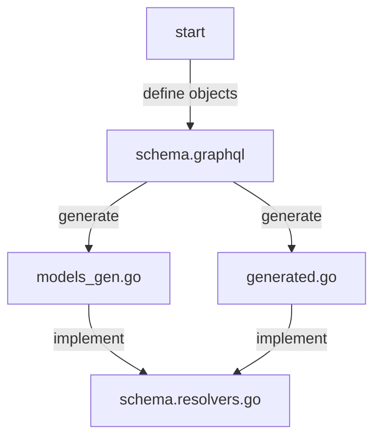
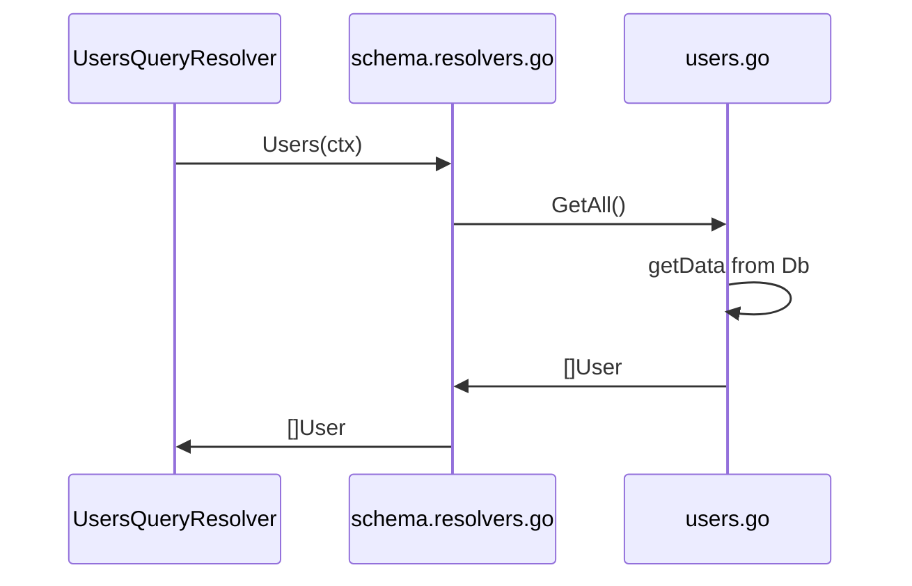

# Key Components

- `schema.graphql` - Objects used in GraphQL layer are defined here. Notice, that they are *not written `go` code*. 

- `graph/model/models_gen.go` - Based on the definitions in `schema.graphql`, corresponding structs *in `go`* are generated here.

- `graph/generated/generated.go` - Also, based on the definitions in `schema.graphql`, necessary queries and mutations declarations are generated *in `go`* here.

- `schema.resolvers.go` - Queries and mutations declared in `graph/generated/generated.go` need to be implemented here. You can (and should) use structs generated in `graph/model/models_gen.go` here.

- `internal` folder - Code that interacts with DB is located here.

# Code Writing Workflow

# Handling Requests

- Example: query `users`

